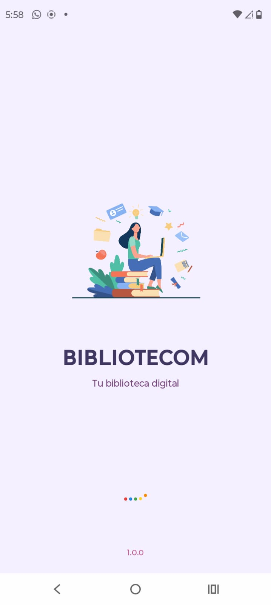
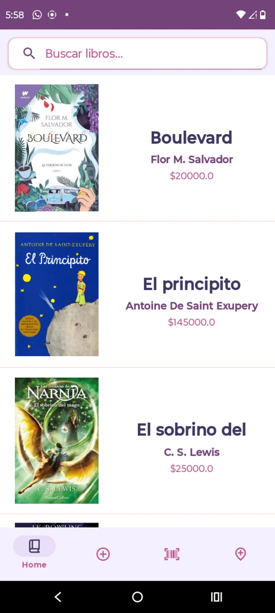

# Biblioteca digital
Aplicación móvil de biblioteca digital desarrollada en Java con Android Studio. Permite gestionar libros, integrando geolocalización con Google Maps, consumo de APIs REST mediante Retrofit y escaneo de códigos QR.

### Splash Sceen y List View

  
  

